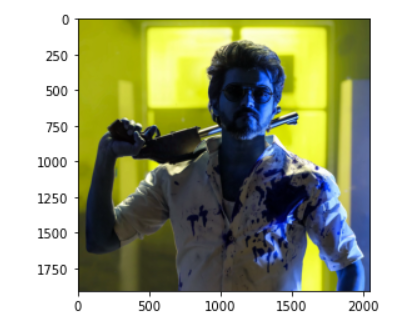
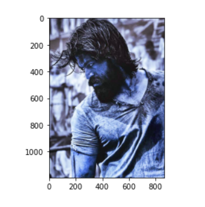
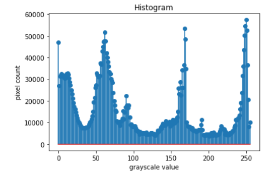
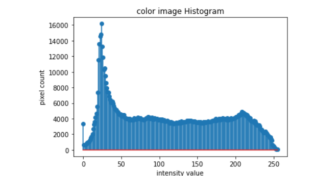
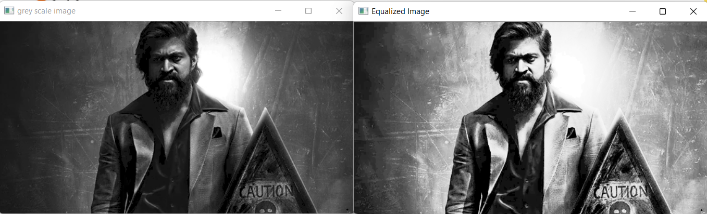

# Histogram and Histogram Equalization of an image
## Aim
To obtain a histogram for finding the frequency of pixels in an Image with pixel values ranging from 0 to 255. Also write the code using OpenCV to perform histogram equalization.

## Software Required:
Anaconda - Python 3.7

## Algorithm:
### Step1:
Import opencv and matplotlib for equalization and display it

### Step2:
Find tthe histogram using cv2.calcHiist()

### Step3:
Display them using matplotlib

### Step4:
Find the equaliation using cv2.equalizeHist()

### Step5:
Display it using matplotlib

## Program:ad
```python
# Developed By: Bharath.V
# Register Number: 212221230013

# Write your code to find the histogram of gray scale image and color image channels.

import cv2
import matplotlib.pyplot as plt
Gray_image=cv2.imread('image1.jpg')
Color_image=cv2.imread('image3.jpg')
plt.imshow(Gray_image)
plt.show()
plt.imshow(Color_image)
plt.show()
hist=cv2.calcHist([Gray_image],[0], None,[256],[0,256])
hist1=cv2.calcHist([Color_image],[1], None,[256],[0,256])


# Display the histogram of gray scale image and any one channel histogram from color image

plt.figure()
plt.title('Histogram')
plt.xlabel('grayscale value')
plt.ylabel('pixel count')
plt.stem(hist)
plt.show()

# Histogram for color image
plt.figure()
plt.title('color image Histogram')
plt.xlabel('intensity value')
plt.ylabel('pixel count')
plt.stem(hist1)
plt.show()


# Write the code to perform histogram equalization of the image. 

# Equalization for gray image
import cv2
Gray_image = cv2.imread("img.png",0)
cv2.imshow('grey scale image',Gray_image)
equ = cv2.equalizeHist(Gray_image)
cv2.imshow("Equalized Image",equ)
cv2.waitKey(0)
cv2.destroyAllWindows

```
## Output:
### Input Grayscale Image and Color Image





### Histogram of Grayscale Image and any channel of Color Image





### Histogram Equalization of Grayscale Image



## Result: 
Thus the histogram for finding the frequency of pixels in an image with pixel values ranging from 0 to 255 is obtained. Also,histogram equalization is done for the gray scale image using OpenCV.
